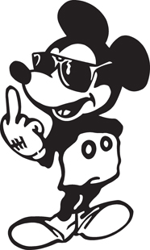

# Ejercicio de Diseño - Ratones inversores

  

 

## Dominio
Desde su cuartel general en Walt Disney World, y bajo una máscara de inocencia, Mickey Mouse (ahora también conocido como Darth Mouse) continúa con sus maléficos planes para conquistar el mundo. Por ahora, no le ha ido nada mal: sus películas son éxitos de taquilla, y no conforme con adquirir Marvel, ahora también compró LucasFilms. 

Lo que nos importa hoy, es que el ratón nos encargó un sistema para ayudarlo. Mickey sólo puede realizar inversiones para las que le alcanza el dinero. Por otro lado, sabe cuales son las inversiones que realizó, además de las que planea hacer. Las inversiones pueden ser:

* **Comprar una compañía.** Las compañías existentes conocen las películas que realizaron y cada película tiene su recaudación. Cada compañía cuesta un porcentaje de la recaudación total de sus películas, y este porcentaje es propio de la compañía.
* **Construir un parque de diversiones.** Construirlo tiene un costo igual al costo de las atracciones que tenga (se conoce el total de cada parque) y el costo de los metros cuadrados de superficie que ocupe el parque. El metro cuadrado de superficie tiene un valor homogéneo para todos los parques (que la inflación puede cambiar).
* **Producir una película.** Tiene un costo de producción, al que se le suma el sueldo de cada personaje. Además existen películas independientes, en las sólo que se paga a los 4 personajes de mayor sueldo, además del costo de producción. 

Se pide:
* Saber el costo de una inversión dada.
* Conocer los personajes involucrados en una inversión, sin repetidos. En una producción de una película, son los personajes propios de la misma. En una compra de una compañía, son los personajes de todas sus películas. En una construcción de parque de diversiones no hay personajes involucrados.
* Saber el costo de las inversiones pendientes del ratón.
* a) Realizar una inversión. b) Realizar las inversiones pendientes, si es posible (según el costo vs. la disponibilidad de capital del ratón inversor). A todo o nada. 

## Parte b) 

Mickey no es el único ratón que intenta conquistar el mundo, tiene numerosos rivales, como ser: Cerebro, Jerry, Daly, Faivel, Pérez, etc. Mickey nos dice que hay alguien que los conoce a todos: el flautista de Hamelín. Para poder compararse con el resto, nos pide incorporar al modelo tanto al flautista como a sus rivales, y agregar los siguientes requerimientos:
* Saber si un ratón es más ratón que otro. Obviamente, es más ratón si tiene un menor costo total de inversiones realizadas.
* Hacer que el flautista toque la flauta. Esto provoca que los ratones ambiciosos (que tienen inversiones pendientes por un costo de más del doble del capital disponible) dilapiden su capital realizando todas las inversiones pendientes que puedan.

## Objetivo

Conocer la tecnología e implementar clases y tests de Xtend.

## Conceptos a ver

* Interfaz y la implementación en clases
* Testeo unitario

